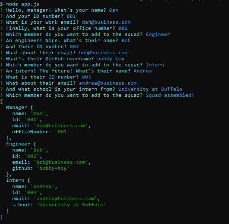

# SQUAD UP
### An app for organizing your squad of engineers and interns
---
1. Use
SQUAD UP is used to create a simple HTML page displaying your squad's information, including all engineers and interns and appropriate contact information, conveniently in one page.

2. Technologies used
SQUAD UP uses node.js, jest, inquirer, Bootstrap and HTML.

3. Future development
Custom employee classes to allow more flexibility.

4. Pictures

5. GitHub Link
https://github.com/dooski/squad-up